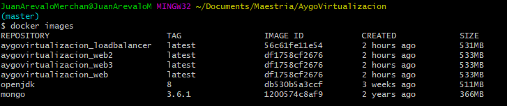
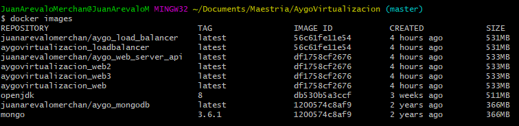
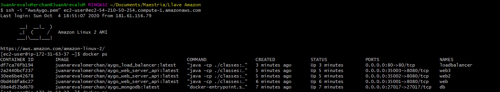
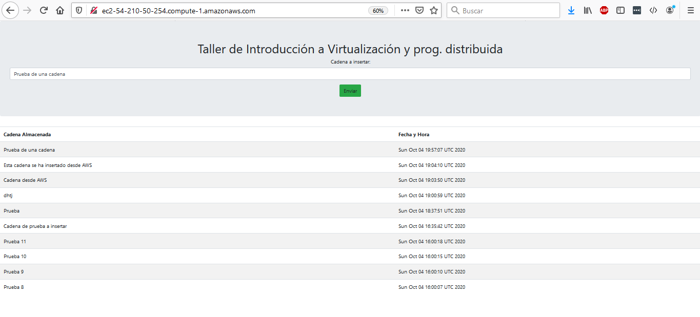

# Virtualización

## OBJETIVOS
	1. Creación de una base de datos no relacional en MongoDB.
	2. Creación API REST, el cuál recibe una cadena, lo almacena en la 
		base de datos no relacional (MongoDB) y retorna los 10 últimos 
		registros que se han insertado.
	3. Creación de un balanceador de carga(API REST), el cuál recibe una 
		cadena y lo envia a uno de los 3 servicios creados (Servicio API REST 
		del punto 2) utilizando Round Robin
	4. Front-End Boostrap
	5. Despliegue de la arquitectura en AWS en una máquina virtual EC3
	
### Diagrama Arquitectura Propuesta

	
## SOLUCIÓN DESARROLLADA

### Requerimientos previos
	1. [Docker](https://www.docker.com/)
	2. [Docker Compose](https://docs.docker.com/compose/).
	
### Balanceo de carga (loadBalancer)
	Se ha desarrollado bajo el framework Spring Boot. 
	En esta parte del proyecto se encuentra almacenado el front-end 
	y el balanceador de carga. El front-end esta desarrollado en 
	boostrap y utiliza JQuery para comunicarse con el balanceador de carga.
	Utiliza el puerto 80.
	
### API REST
	Se ha desarrollado con el framework Spring Boot.
	Utiliza Dependence Injection
	Utiliza la libreria MongoRepository para la conexión con la base de datos Mongo.
	Utiliza el puerto 8080

### Base de datos No relacional	
	Se ha utilizado la imagen docker mongo:3.6.1

## INSTALACIÓN
	
	1. Clonar el repositorio: (Consola)
	
	git clone https://github.com/JuanPabloArevalo/AYGOVirtualizacion

	
	2. Generar el ejecutable de los APIRest (Consola)

	cd loadBalancer
	mvn clean install
	cd ..
	cd laboratorioVirtualizacionAYGO
	mvn clean install
	cd ..

	
	3. Ejecutar el docker-compose (Consola)
	
	docker-compose up -d 

	
	Al abrir docker debe quedar así:

	

## PRUEBAS LOCAL
	1. Abrir navegador con la URL localhost:

	2. Insertar una nueva cadena y validar datos ingresados

## Despliegue Imagenes DockerHub

	1. Desplegar las imagenes en docker:
		APIRest:
		$ docker tag aygovirtualizacion_web juanarevalomerchan/aygo_web_server_api
		$ docker push juanarevalomerchan/aygo_web_server_api:latest
		
		Balancedor Carga:
		$ docker tag aygovirtualizacion_loadbalancer juanarevalomerchan/aygo_load_balancer
		$ docker push juanarevalomerchan/aygo_loadbalancer:latest
		
		Base datos NoRelacional MongoDB:
		$ docker tag mongo:3.6.1 juanarevalomerchan/aygo_mongodb
		$ docker push juanarevalomerchan/aygo_mongodb:latest

	En Docker HUB al consultar:

## Despliegue en AWS
 1. Crear una máquina virutal EC2
 2. Instalar docker en la máquina virutal
	$ sudo yum update -y
	$ sudo yum install docker
	$ sudo usermod -a -G docker ec2-user
	$ sudo service docker start
 3. Correr las imagenes
	a. Imagen de la base de datos:  docker run -d -p 27017:27017 --name db -v mongodb:/data/db -v mongodb_config:/data/configdb juanarevalomerchan/aygo_mongodb:latest
	b. Imagen del APIRest 1: docker run -d -p 35001:8080 --name web juanarevalomerchan/aygo_web_server_api:latest
	c. Imagen del APIRest 2: docker run -d -p 35002:8080 --name web2 juanarevalomerchan/aygo_web_server_api:latest
	d. Imagen del APIRest 3: docker run -d -p 35003:8080 --name web3 juanarevalomerchan/aygo_web_server_api:latest
	e. Imagen Balanceador carga: docker run -d -p 80:80 --name loadbalancer juanarevalomerchan/aygo_load_balancer:latest
    Se debe ver las instancias así:

## Prueba desde AWS

	
		
	
	

